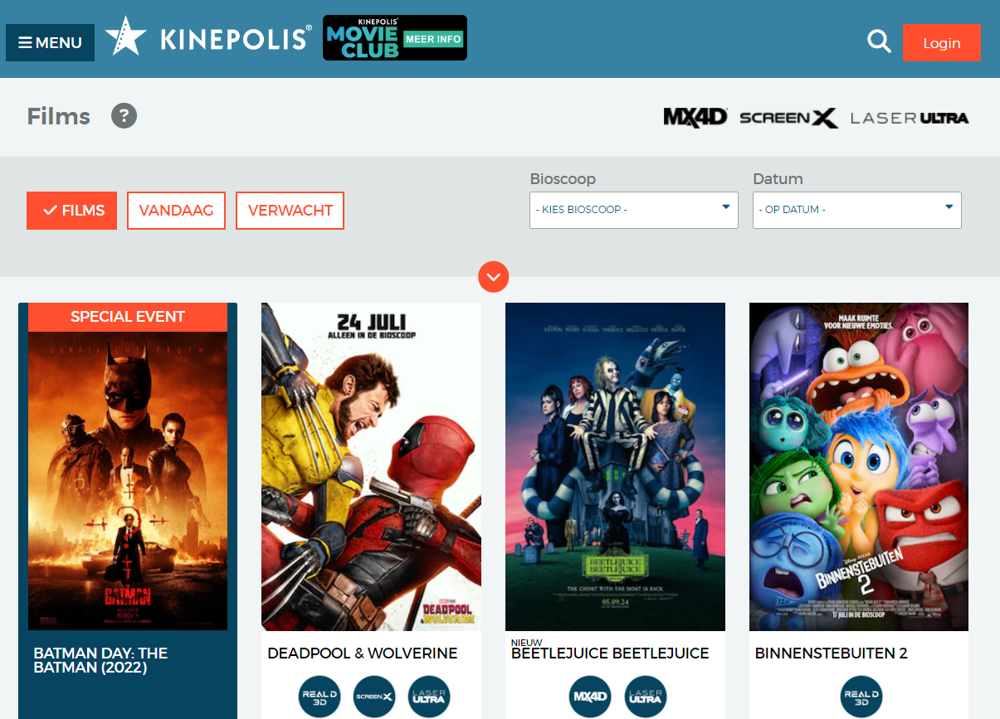
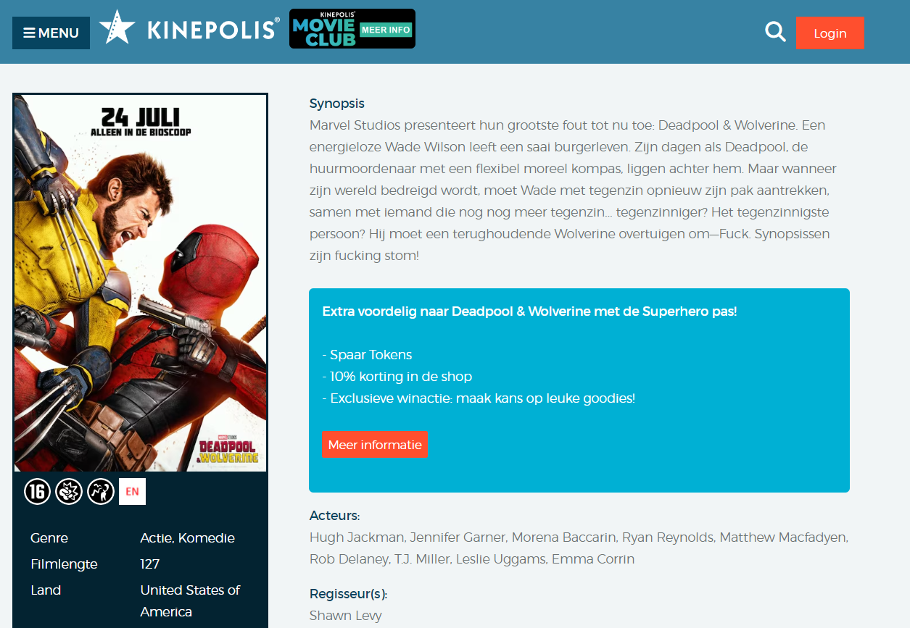
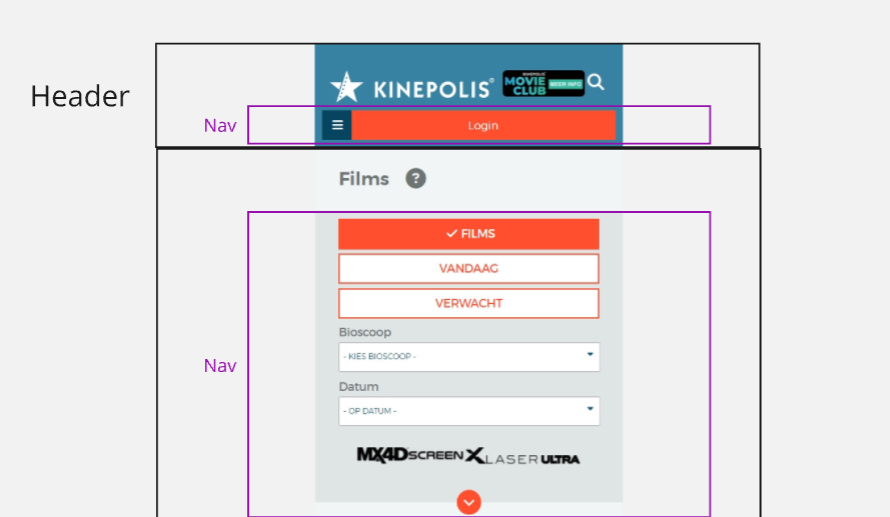
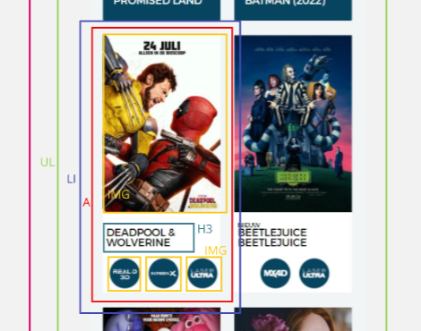

# Procesverslag
Markdown is een simpele manier om HTML te schrijven.  
Markdown cheat cheet: [Hulp bij het schrijven van Markdown](https://github.com/adam-p/markdown-here/wiki/Markdown-Cheatsheet).

Nb. De standaardstructuur en de spartaanse opmaak van de README.md zijn helemaal prima. Het gaat om de inhoud van je procesverslag. Besteedt de tijd voor pracht en praal aan je website.

Nb. Door *open* toe te voegen aan een *details* element kun je deze standaard open zetten. Fijn om dat steeds voor de relevante stuk(ken) te doen.

## Jij

  
uitwerken voor kick-off werkgroep

  ### Auteur:
  Lars Veldhuijs

  #### Je startniveau:
  Blauw/Rood, ik kan het wel, maar vind het wel lastig. en het is inmiddes wel weer een tijdje geleden dat ik code heb geschreven. Heb in de minoren de keus gemaakt om meer te focussen op ux/ui design. Andere programmeer vakken wel gehaald, dus de kennis moet nog ergens zijn. Ik ben benieuwd hoe snel ik het weer kan oppakken!

  #### Je focus:
  Surface Plane
 

## Je website

  
uitwerken voor kick-off werkgroep

  ### Je opdracht:
  https://kinepolis.nl/?main_section=films

  #### Screenshot(s) van de eerste pagina (small screen): 
   Overzichtspagina  
  

  #### Screenshot(s) van de tweede pagina (small screen):
   Detailpagina film  
  
 

## Toegankelijkheidstest 1/2 (week 1)

  
uitwerken na test in 2e werkgroep

  ### Bevindingen
  Lijst met je bevindingen die in de test naar voren kwamen:
  - Bij de start van de screenreader leest hij eerst de cookie instellingen die onder aan de pagina staan. Je zou verwachten dat de screenreader bovenaan begint met voorlezen.
  - Je hoort heel veel ''spatie'' als je tussen de elementen wilt switchen.
  - Bij het voorlezen van alle links hoor je bij elke link ''2 van 365 geselecteerd'', geen nuttige info
  - In het menu lijkt het alsof de menuitems uit verschillende onderdelen bestaan, als je erover heen leest hoor je eerst de    hoeveelheid lijst items en hoeveel deze is en daarna moet je nog een keer klikken om te horen welk menu item het is.
  - Hij herkent de headings niet
  - Je kan naar het kopje bioscoop maar vervolgens worden alle bioscopen opgenoemd, en kan je eigenlijk geen bioscoop selecteren.
  - Zelfde geldt voor datum, Je kan naar het kopje datum maar vervolgens worden er geen datums opgenoemd, en kan je eigenlijk geen bioscoop selecteren.
  - Je kan de filters selecteren maar vervolgens niet echt een keuze maken tussen de filters
  - Tijdens het gebruiken van de tab toets gaat het steeds terug naar het menu waardoor je steeds elke keer het hele menu door moet om weer verder te gaan.
  - Als je dan eenmaal in het menu weer zit ga je steeds van kopje naar kopje zonder enige aankondiging.

## Breakdownschets (week 1)

  
uitwerken na afloop 3e werkgroep

  ### de hele pagina: 
  

  ### dynamisch deel (bijv menu): 
  

  ### wellicht nog een dynamisch deel (bijv filter): 
  

## Voortgang 1 (week 2)

  
uitwerken voor 1e voortgang

  ### Stand van zaken
  In deze tweede week van het maken van de pagina's voor mijn website merkte ik vooral dat het weer even inkomen was. Ik heb de afgelopen 1,5 jaar weinig met code gewerkt en mij vooral gefocused op UX. Maar zodra ik weer meer tijd in de code ging stoppen kwamen er steeds meer dingen terug en ging het ook steeds beter. Ik heb deze week vooral de basis html en css van beide pagina's opgezet en ben begonnen met het toevoegen van css van de hoofdpagina. Hier liep ik er vooral tegen aan dat ik het positioneren van bepaalde elementen, naast elkaar en onder elkaar met verschillende rijen en kolommen best lastig vind. Hier heb ik veel tijd en moeite in moeten stoppen om dit enigszins op een goede manier op de pagina te krijgen. Ik ben nog niet helemaal tevreden en hoop dit met de hulp van de studentassistenten op te lossen. Verder merk ik dat het werken met javascript soms lastig gaat. Het hamburger menu werkt niet optimaal, dit hoop ik ook komende week op te lossen. Verder gaat het eigenlijk best goed, hoe meer ik bezig ben, hoe meer er lukt en hoe leuker ik het vind.

  ### Agenda voor meeting
  Meeting 1: 13-9-24    (Studentassistenten)
  Club B1: Louiza, Penelope, Alyssa, Andrea, Lars

  - Carrousel maken
  - Verschil buttons/links
  - Position met ul/li juiste manier?
  - Werking hamburger menu

  ### Verslag van meeting
  De meeting met de studentassistenten ging goed en was fijn om gebruik van te maken. We bespraken de gezamelijke vragen en gingen 1 voor 1 in op de persoonlijke vragen die we hadden over onze eigen website. De studentenassistenten hielpen ons bepaalde vragen op te lossen en de rest keek bij elkaar mee om er ook wat van te leren.

  Persoonlijk wilde ik graag dat ze meekeken met de verschillende posities van de elementen op mijn site en hoe ik dat op de beste manier zou kunnen oplossen. Zoals ik bij de stand van zaken al vertelde had ik hier soms nog wel is moeite mee, maar dit konden ze op een goede en juiste manier laten zien. Ik hoop deze methodes verder toe te kunnen passen komende week zodat de positie van alle elementen klopt. Tot slot had ik nog wat vragen over het hamburger menu die nog niet zo goed werkte als zou moeten. Hier zouden ze in teams nog meer informatie over sturen, dus ik hoop dat het dan wel lukt! Ik kijk uit om volgende week het grootste gedeelte van de site af te hebben.

## Voortgang 2 (week 3)

  
uitwerken voor 2e voortgang

  ### Stand van zaken
  In deze 3e week staat het grootste gedeelte van mijn 2 pagina's. De html, css en javascript zijn bijna volledig geschreven en alleen de laatste dingen, zoals positioning van sommige elementen moet nog goed gezet worden. Ik ben eigenlijk tot nu toe heel tevreden over hoe het gaat. De meeste problemen kan ik zelf oplossen en vind het dan ook tof als het lukt en ik zie dat het goed staat op mijn pagina's. De positioning is een stuk verbeterd sinds vorige week, met het gebruik van grid, en flexbox heb ik een groot gedeelte goed in positie kunnen zetten. Het hamburger menu is nog steeds wel een dingetje, deze werkt nu wel alleen die terug button verdwijnt steeds. Ik hoop het hier in de feedbacksessie met Danny over te hebben en te regelen. Voor de laatste week is het een kwestie van puntjes op de i en kan ik me focussen om de 5 punten van surface plain toe te voegen.

  ### Agenda voor meeting
  Meeting 2: 20-9-24  (Docent)
  Club B1: Louiza, Penelope, Alyssa, Andrea, Lars

  - Gekozen om vooral persoonlijke problemen op te pakken tijdens deze meeting en bij elkaar mee te kijken

  Persoonlijke problemen:
  - Hamburger menu waarbij de terug button verdwijnt
  - Algemene vraag over het stukje toegankelijkheid, hoever uitwerken
  - Gebruik van grid checken
  - Door Css lopen

  ### Verslag van meeting
  Deze meeting met Danny was ook weer erg nuttig. We gingen het rijtje af en iedereen kon ijn website laten zien en vragen stellen die de persoon had. Iedereen kon meekijken of dingen verwerken op hun eigen site die verbeterd konden worden. Voor mij persoonlijk heb ik samen met Danny naar mijn code gekeken, het zag er allemaal keurig uit, wel kon ik bij de css soms wat dingen korter doen om het niet dubbel aan te roepen. Dit zal ik nog aanpassen. Ook kon in de html het grid gedeelte op een makkelijkere manier. Danny heeft hiervoor een link gegeven waar ik naar kan kijken. Ik ga proberen dit nog te veranderen als het werkt. Verder kreeg ik complimenten dat ik zo door moest gaan en de puntjes op de i moest zetten. Voor het hamburgermenu heb ik ook wat tips gekregen om naar de z-index te kijken en of de position:relative wel aanstaat. Dit heb ik vrijsnel na de les kunnen fixen en werkt nu naar behoren.

## Toegankelijkheidstest 2/2 (week 4)

  
uitwerken na test in 9e werkgroep

  ### Bevindingen
 Als ik deze test vergelijk met de eerste test heb ik ervoor gezorgd dat de alt teksten veel beter leesbaar waren. Verder waren de overgangen ook veel logischer, je ging gewoon met de pagina mee ipv van links naar beneden en weer omhoog. De pagina was heel goed volgbaar. Verder waren ook de rare en hoge getallen niet te horen en hoorde je nu alleen de nuttige dingen. Kortom ik denk dat mijn site ook in toegankelijkheid een stuk simpeler geworden is om te gebruiken.

## Voortgang 3 (week 4)

  
uitwerken voor 3e voortgang

  ### Stand van zaken
  Deze week vooral bezig geweest met het uitwerken van de 5 onderwerpen voor de surface plane. Ik heb gekozen voor de volgende 5 onderwerpen:
  1. Video/geluid
  2. Animatie
  3. Werkend filteren
  4. Extra microinteractie (like hartje)
  5. Scroll carrousel

  ### Agenda voor meeting
  Meeting 3: 27-9-24  (Docent)
  Club B1: Louiza, Penelope, Alyssa, Andrea, Lars

  - Gekozen om vooral persoonlijke problemen op te pakken tijdens deze meeting en bij elkaar mee te kijken

 ### Verslag van meeting
  Ziek helaas, dus niet kunnen bijwonen...

## Eindgesprek (week 5)

  
uitwerken voor eindgesprek

  ### Je uitkomst - karakteristiek screenshots:
  
  
  
  
  
  

  ### Dit ging goed/Heb ik geleerd: 
  Ik heb echt geleerd hoe je een website vanaf 0 op een goede manier kan opbouwen. Ik ben echt blij hoe ik in de laatste weken van even geen idee meer hebben hoe het ook alweer werkte naar nu een werkende site te zijn gegaan, waar ik ook nog eens veel nieuwe dingen geleerd hebt. Waar ik het meest trots op ben is dat ik het positie gedeelte wel goed onder de knie heb gekregen, ik bergijp steeds beter hoe je wat kunt toe passen en wanneer de beste manier is. Verder heb ik ook weer een grote stap in Javascript gezet door verschillende animaties te maken, zoals een hamburgermenu. Ik ben blij dat ik al deze nieuwe informatie kan meenemen naar mijn stage straks.

  ### Dit was lastig/Is niet gelukt:
  Het lastigste vond ik in het begin om alles op de juiste positie op de pagina te krijgen, maar na wat hulp en veel tijd in het lezen van uitleg heb ik het onder de knie gekregen en ben ik trots op het resultaat. Wat ik wel lastig vond en waar ik uiteindelijk misschien net te weinig tijd voor heb gehad zijn de vijf onderwerpen van de surface plane. Ik had hier nog net iets mooier willen maken, zoals het filteren op films is in de layout nog net niet zoals ik gewild had. Verder ben ik aardig tevreden hoe mijn pagina's er nu uit zien.

## Bronnenlijst

  
continu bijhouden terwijl je werkt

1. Studentenassistenten
2. Danny 
3. Codepen uit de les
4. Codepen klikbaar hartje
5. Chatgpt - Hoe kan je een filter menu werkbaar krijgen?
6. https://www.w3schools.com/css/css3_animations.asp
7. https://www.w3schools.com/html/html_scripts.asp
8. DLO
9. https://kinepolis.nl/?main_section=films
10. https://www.youtube.com/

